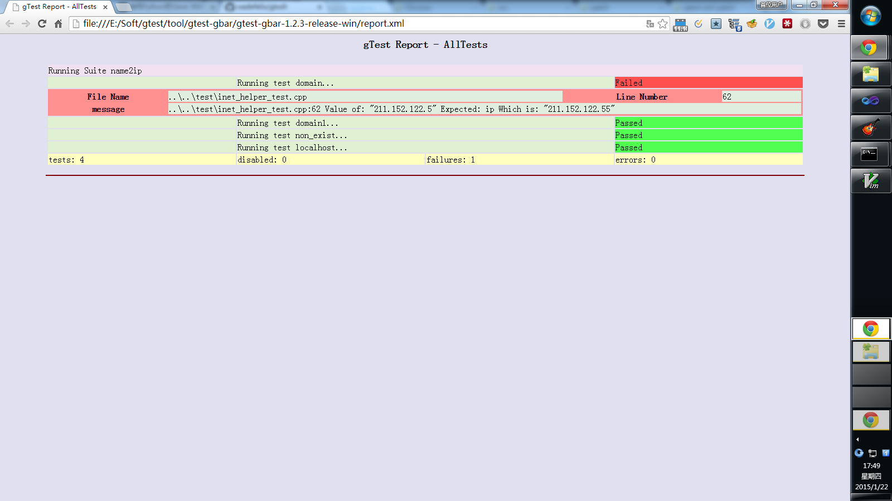

# gtest-xml-patch

Let xml display of gtest outputs much more beautiful!

Like this



# Depends

-   gtest-1.7.0

# Usage

## Patch gtest

### Use patch tool

-   downalod `patch`

-   copy `patch` to `gtest/src`

-   go to `gtest/src`

-   execute `patch gtest patch`

### Manual

-   open `gtest/src/gtest.cc`

-   go to line `3363`

```patch
   const std::string kTestsuites = "testsuites";
 
   *stream << "<?xml version=\"1.0\" encoding=\"UTF-8\"?>\n";
+  *stream << "<?xml-stylesheet type=\"text/xsl\" href=\"gtest-result.xsl\" ?>\n";
+  *stream << "<!DOCTYPE testsuites SYSTEM \"gtest-result.dtd\">\n";
   *stream << "<" << kTestsuites;
 
   OutputXmlAttribute(stream, kTestsuites, "tests",

```

## Copy `gtest-result.dtd` `gtest-result.xsl` to the directory of `report.xml` which generates by gtest

## Double click `report.xml`

**Note:**

-   If you use chrome to open, maybe you need to add boot flags `--allow-file-access-from-files`

## That's done

# References

1.  <https://github.com/wadefelix/gtxslt>
